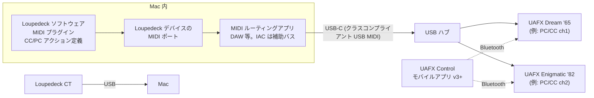

> 発行日: 2026-07-27
> テーマ: Universal Audio のギターペダル UAFX Dream '65 Reverb Amplifier / UAFX Enigmatic '82 Overdrive Special Amp を、macOS 上の Loupedeck CT からコントロールするための構成方法の整理と、各ペダルの MIDI PC / CC 割当一覧（UA・Loupedeck・Apple の一次情報ベース）

## TL;DR

- **UAFX ペダルの MIDI 入力は USB-C（クラスコンプライアント USB MIDI）のみ**。5-pin DIN / TRS MIDI 端子はなく、Bluetooth MIDI も非対応。利用には **ファームウェア UAFX 2.0 以降 + UAFX Control モバイルアプリ v3 以降**が必須で、MIDI チャンネル（PC 用と CC 用で別々に設定可）は UAFX Control アプリから有効化する（デフォルトは無効）。
- **Loupedeck CT はネイティブ単体の MIDI コントローラーではなく、Loupedeck ソフトウェアの「MIDI プラグイン」経由で CC / PC / Note を送る**（対応デバイスは CT と Live/S のみ）。ターゲットソフト側からは「Loupedeck デバイス」が MIDI コントロールサーフェス（MIDI ポート）として見える。
- **PC（Program Change）は 0–127 の 128 スロットに任意のプリセットを割り当てる方式**で、固定のファクトリー PC マップは存在しない（割当は UAFX Control アプリで行う）。CC マップは両ペダルとも公式マニュアルに全表が掲載されており、本レポート末尾に転記した（MIDI CC 制御は現時点でオープンベータ）。
- macOS 上の経路は「Loupedeck CT →（Loupedeck ソフト / MIDI プラグイン）→ Mac 内 MIDI ルーティング（DAW 等。IAC ドライバはアプリ間バス）→ USB-C → ペダル」。ただし **UA の公式ドキュメントが明示するサポート構成は「USB ホスト対応 MIDI インターフェース」経由のみ**で、「Mac を USB ホストにして直接 MIDI 送信する」構成そのものはサポート構成として明記されていない（後述の注意参照）。

## 対象製品と前提

| 項目 | Dream '65 Reverb Amplifier | Enigmatic '82 Overdrive Special Amp |
|---|---|---|
| 公式マニュアル | [UAFX Dream '65 Reverb Amplifier Manual](https://help.uaudio.com/hc/en-us/articles/6432520866068-UAFX-Dream-65-Reverb-Amplifier-Manual) | [UAFX Enigmatic '82 Overdrive Special Amp Manual](https://help.uaudio.com/hc/en-us/articles/30088097713428-UAFX-Enigmatic-82-Overdrive-Special-Amp-Manual) |
| MIDI 対応 | CC / PC 対応（MIDI Beat Clock 非対応） | CC / PC 対応（MIDI Beat Clock 非対応） |
| 物理 MIDI 端子 | なし（USB Type-C のみ） | なし（USB Type-C のみ） |

- 両ペダルとも仕様表の USB Type-C の説明は「For registration and firmware updates via computer」だが、UAFX 2.0 ファームウェア以降は **この USB-C ポートがクラスコンプライアント USB MIDI の受け口**になる。UA いわく「All dual-footswitch UAFX pedals are now MIDI-capable over class-compliant USB with a firmware update and UAFX Control mobile app update」（[Getting started with UAFX 2.0 USB MIDI](https://help.uaudio.com/hc/en-us/articles/43191950601620-Getting-started-with-UAFX-2-0-USB-MIDI)）。
- Bluetooth は UAFX Control アプリ接続専用で、**MIDI over Bluetooth（WIDI）は非対応**（[FAQ: UAFX 2.0 Update](https://help.uaudio.com/hc/en-us/articles/43054910657044-FAQ-UAFX-2-0-Update)）。
- 注意: UA には型番の似た小型ペダル「Dream '65 Reverb **Amp**」（別マニュアル: [Dream '65 Reverb Amp Manual](https://help.uaudio.com/hc/en-us/articles/30847237412500-Dream-65-Reverb-Amp-Manual)）が存在する。UAFX 2.0 の MIDI 化対象は「dual-footswitch UAFX Pedals」であり、本レポートはフットスイッチ2基の「Dream '65 Reverb **Amplifier**」を対象とする。

## UAFX ペダル側の MIDI 仕様（共通）

出典: [USB MIDI with UAFX Pedals Manual](https://help.uaudio.com/hc/en-us/articles/43105954567956-USB-MIDI-with-UAFX-Pedals-Manual)、[FAQ: UAFX 2.0 Update](https://help.uaudio.com/hc/en-us/articles/43054910657044-FAQ-UAFX-2-0-Update)、[UAFX 2.0 USB MIDI Troubleshooting](https://help.uaudio.com/hc/en-us/articles/43206511122964-UAFX-2-0-USB-MIDI-Troubleshooting)

### 必要なもの

1. **ファームウェア UAFX 2.0 以降** — macOS Big Sur 以降 / Windows 10 以降の PC 上の UA Connect アプリで USB-C 経由アップデート。
2. **UAFX Control モバイルアプリ v3 以降**（iOS / Android） — MIDI の有効化・チャンネル設定・PC スロット割当・CC 一覧確認 / CC Learn / CC 無効化はすべてこのアプリで行う。**MIDI はデフォルトで無効**。
3. **USB ホスト** — ペダルは USB「デバイス」であり、MIDI 送信側に USB ホスト機能が必要。UA が挙げるのは (a) USB ホストポート内蔵 MIDI コントローラー（Morningstar MC6/MC8 Pro 等）、(b) 5-pin DIN コントローラー + USB ホスト MIDI インターフェース（CME H2MIDI Pro 等）。複数ペダルは USB ハブで分配（USB 2.0 プロトコル、アンパワードハブ可）。

### MIDI チャンネル設定

- UAFX Control アプリ → ペダル画面右上の **MIDI アイコン** → 「MIDI Program Change」「MIDI CC」それぞれで **Omni / Disabled / 1–16ch** を選択。**PC と CC に別チャンネルを割り当て可能**。
- 複数ペダル同時切替には Omni、ペダル個別制御には個別チャンネルを使う運用が公式推奨。

### 制約・注意

- **ペダルへの USB ホスト接続は同時に1つだけ**。USB MIDI 使用中は UAFX Control とは Bluetooth で接続する（USB 有線でのアプリ接続と MIDI は排他）。
- **MIDI CC 制御は現在オープンベータ**（PC / プリセット割当は正式機能）。
- 複数メッセージの送信順序: ペダル個別マニュアルは「① Program Change → ② Bypass/Unbypass → ③ その他の CC」、総合マニュアル（USB MIDI with UAFX Pedals Manual）は「① Bypass/Unbypass → ② Program Change → ③ エフェクト選択 → ④ その他」と記載しており、**両文書間で順序の記述が食い違っている**。いずれも「先にアルゴリズムをロードさせてから残りの CC を送る」趣旨は共通。
- トラブルシューティングの第一歩として UA は「CC 19 value 0（バイパス）→ CC 19 value 2（右 FS アクティブ）を1つずつ送る」テストと、[Snoize MIDI Monitor](https://www.snoize.com/MIDIMonitor/)（macOS 無料）での送信データ確認を推奨。

### MIDI PC（Program Change）の仕様

- **PC 番号 0–127 の 128 スロット**が使える（「128 recallable presets using MIDI program change」/ FAQ: UAFX 2.0 Update）。
- **固定のファクトリー PC 対応表は存在しない**。UAFX Control アプリでプリセットごとに「Assign to PC Slot」でスロットに割り当てる方式（割当時に Bypass 状態も一緒に保存可能）。
- PC に割り当てたプリセットを本体 STORE で上書き保存すると、新しい保存内容が自動的に同じ PC に追従する。

| PC 番号 | 呼び出されるプリセット |
|---|---|
| 0–127 | UAFX Control アプリでユーザーが各スロットに割り当てたプリセット（+ 任意で Bypass 状態）。工場出荷時の固定割当はなし |

## Dream '65 Reverb Amplifier の MIDI CC 一覧

出典: [UAFX Dream '65 Reverb Amplifier Manual — Dream '65 MIDI CCs](https://help.uaudio.com/hc/en-us/articles/6432520866068-UAFX-Dream-65-Reverb-Amplifier-Manual)（値 0,1 の CC は特記なき限り 0 = Off / 1 = On。フットスイッチ系 CC の機能は本体のフットスイッチモードに依存）

| CC 番号 | 対象パラメータ | 値域と意味 |
|---|---|---|
| 7 | Output | 0–127 |
| 12 | FS Left（左フットスイッチ） | 0,1（1 でスイッチをトグル） |
| 13 | FS Right（右フットスイッチ） | 0,1（1 でスイッチをトグル） |
| 14 | Cab Up | 0,1（1 でスイッチをトグル） |
| 15 | Cab Down | 0,1（1 でスイッチをトグル） |
| 16 | Store | 0 = Off / 1 = Hold |
| 17 | Mod Select | 0 = Lead / 1 = Stock / 2 = D-Tex |
| 18 | Cab Select | 0–5 = キャビネット / 6 = No Cab（6 超は誤操作防止のため Cab 1 扱い） |
| 19 | Bypass | 0 = Bypass / 1 = Unbypass Left FS / 2 = Unbypass Right FS |
| 22 | Volume | 0–127 |
| 31 | Bass | 0–127 |
| 33 | Treble | 0–127 |
| 40 | Boost Enable | 0,1 |
| 41 | Boost Gain | 0–127 |
| 50 | Reverb Enable | 0,1 |
| 51 | Reverb | 0–127 |
| 60 | Vib Enable | 0,1 |
| 61 | Vib Speed | 0–127 |
| 62 | Vib Intensity | 0–127 |

## Enigmatic '82 Overdrive Special Amp の MIDI CC 一覧

出典: [UAFX Enigmatic '82 Overdrive Special Amp Manual — Enigmatic MIDI CCs](https://help.uaudio.com/hc/en-us/articles/30088097713428-UAFX-Enigmatic-82-Overdrive-Special-Amp-Manual)（値 0,1 の CC は特記なき限り 0 = Off / 1 = On。フットスイッチ系 CC の機能は本体のフットスイッチモードに依存）

| CC 番号 | 対象パラメータ | 値域と意味 |
|---|---|---|
| 7 | Output | 0–127 |
| 12 | FS Left（左フットスイッチ） | 0,1（1 でスイッチをトグル） |
| 13 | FS Right（右フットスイッチ） | 0,1（1 でスイッチをトグル） |
| 14 | Cab Up | 0,1（1 でスイッチをトグル） |
| 15 | Cab Down | 0,1（1 でスイッチをトグル） |
| 16 | Store | 0 = Off / 1 = Hold |
| 17 | Model Select（Tone） | 0 = Rock / 1 = Jazz / 2 = Custom（Custom はデフォルトで Rock モデル。CC からは Jazz に設定不可、UAFX Control で手動編集） |
| 18 | Cab Select | 0–8 = キャビネット / 9 = No Cab（9 超は誤操作防止のため Cab 1 扱い） |
| 19 | Bypass | 0 = Bypass / 1 = Unbypass Left FS / 2 = Unbypass Right FS |
| 20 | Channel（入力） | 0 = Normal / 1 = FET |
| 21 | Amp | 0 = 50W high plate / 1 = 100W low plate, squishy PS / 2 = 100W high plate, stiff PS / 3 = 100W low plate, very stiff PS |
| 22 | Volume | 0–127 |
| 23 | Overdrive | 0–127 |
| 24 | Overdrive Enable | 0,1 |
| 25 | Ratio | 0–127 |
| 26 | Master | 0–127 |
| 27 | FET Trim | 0–127 |
| 28 | OD Trim | 0–127 |
| 30 | Room | 0–127 |
| 31 | Bass | 0–127 |
| 32 | Middle | 0–127 |
| 33 | Treble | 0–127 |
| 34 | Presence | 0–127 |
| 35 | Deep/Mid | 0,1 |
| 36 | Bright | 0 = None / 1 = 150 pF / 2 = 196 pF / 3 = 300 pF |
| 37 | Tonestack | 0 = Classic / 1 = Skyline |
| 40 | Boost Enable（Preamp Boost） | 0,1 |
| 50 | HRM Enable | 0,1 |
| 51 | HRM Bass | 0–127 |
| 52 | HRM Middle | 0–127 |
| 53 | HRM Treble | 0–127 |

補足: CC 番号はいずれも工場出荷時のデフォルト。UAFX Control アプリの **MIDI Learn で任意の CC 番号に再割当**でき、CC 単位の無効化・工場出荷値へのリセットも可能（[USB MIDI with UAFX Pedals Manual](https://help.uaudio.com/hc/en-us/articles/43105954567956-USB-MIDI-with-UAFX-Pedals-Manual)）。

## Loupedeck CT 側の MIDI 機能

出典: [MIDI - Plugin Instructions（Loupedeck 公式、support.loupedeck.com/midi-manual）](https://support.loupedeck.com/midi-manual)（現行サイトはトップへリダイレクトされるため [2025-01-22 時点のアーカイブ](https://web.archive.org/web/20250122010516/https://support.loupedeck.com/midi-manual)で確認）、[Release Notes 5.0.0](https://support.loupedeck.com/release-notes-5.0)

- **MIDI 機能は Loupedeck ソフトウェアの「MIDI プラグイン」として提供**され、対応デバイスは **Loupedeck CT と Live/S**（「Here's how to use Loupedeck's MIDI plugin feature (LD CT & Live/S)」）。つまり Loupedeck CT 単体がスタンドアロンの MIDI コントローラーとして振る舞うのではなく、**Mac 上の Loupedeck ソフトウェアが必須**。
- 使い方: Loupedeck ソフトウェアの対象プロファイルで「Add Actions」から MIDI プラグインを追加し、**MIDI Press Action / Rotation Adjustment** を自作してボタン・ダイヤルにマッピングする。
- 受け側のソフトでは「**Loupedeck デバイスを MIDI コントロールサーフェスとして選択**」し、MIDI ポートの入出力を有効にする——つまり OS からは Loupedeck デバイス名の MIDI ポートが見える構造（macOS では Audio MIDI 設定の MIDI スタジオで確認できる想定。Windows は「1アプリからのみ使用可」と明記あり。macOS 固有の内部実装の記載はなし）。
- 送信できるメッセージと設定項目:

| アクション種別 | 送信内容 | 設定項目 |
|---|---|---|
| CC Toggle（Press） | CC | CC 番号 1–119 / 1st Value・2nd Value（押すたび交互送信）/ ch 1–16 |
| CC Value（Press） | CC | CC 番号 1–119 / 値 0–127 / ch 1–16 |
| Note（Press） | Note | ノート番号・Play/Toggle・長さ（最大 15,000 ms）・ベロシティ 0–127 / ch 1–16 |
| Program Change（Press） | PC | プログラム番号 0–127 / ch 1–16 |
| Delay（Press） | — | コマンド間ディレイ（ms）。連続コマンドのチェーン用 |
| CC Value（Rotation） | CC | CC 番号 1–119 / 開始値 0–127 / ch 1–16（ダイヤル回転で値を増減） |
| Program Change（Rotation） | PC | プログラム番号 0–127 / ch 1–16 |

- 留意点（Loupedeck 公式記載）:
  - レイテンシに既知の問題があり「リアルタイム演奏より“コントロールサーフェス”用途向け」と明記。UAFX の音色切替・パラメータ操作用途なら実用上問題になりにくい。
  - ソフトウェア 5.0 時点の Known Issue として「MIDI プラグインの UI は新 UI に未実装。Classic UI View で MIDI アクションを作成すること」（Release Notes 5.0.0）。マニュアル自体も「for 4.3 (Classic UI)」版が最終。
  - CC Toggle の ON/OFF 慣習（63 以下 = OFF / 64 以上 = ON）は一般的な MIDI 機器向けの記述。**UAFX の 0,1 型 CC は「0 = Off / 1 = On」定義**なので、CC Toggle の 1st/2nd Value は 0 と 1 を明示的に設定するのが安全。

## macOS 上の MIDI ルーティング（Apple 公式ツールの範囲）

出典: [Mac の Audio MIDI 設定で MIDI 装置を設定する（Apple サポート）](https://support.apple.com/guide/audio-midi-setup/set-up-midi-devices-ams875bae1e0/mac)、[Mac の Audio MIDI 設定でアプリケーション間で MIDI 情報を転送する（IAC ドライバ）](https://support.apple.com/guide/audio-midi-setup/transfer-midi-information-between-apps-ams1013/mac)

- **Audio MIDI 設定 → ウインドウ → MIDI スタジオ**で、Mac に USB 接続された MIDI インターフェース／デバイスが表示される（「If you have a MIDI interface connected to the USB port on your Mac, it should appear in the MIDI Studio window」）。UAFX ペダルはクラスコンプライアント USB MIDI なので、USB-C 接続時にここに現れることが期待できる（下記「未確認事項」参照）。
- **IAC ドライバは「アプリ間」の仮想 MIDI バス**。MIDI スタジオで IAC ドライバをダブルクリック →「装置はオンライン」にチェック → バス（ポート）を追加して使う。あるアプリが送信先、別のアプリが受信元として同じバスを使う仕組みで、**物理デバイス同士を直接つなぐ機能ではない**。
- したがって「Loupedeck CT ポートから入って来た MIDI を UAFX ペダルの MIDI ポートへ転送する」には、**入力ポートと出力ポートを選べる MIDI 対応アプリ（DAW: Logic Pro / Ableton Live 等、または MIDI ルーティングユーティリティ）を1つ挟む**必要がある。macOS 標準機能だけでデバイス間を自動ブリッジする仕組みはない（IAC はその際の中継バスとして併用できる）。

## 接続構成

### 構成 A: Mac をハブにする構成（Loupedeck CT を使う場合の基本形）



テキスト表記:
`Loupedeck CT →(USB)→ Mac【Loupedeck ソフト(MIDI プラグイン) → MIDI ルーティングアプリ】→(USB-C)→ USB ハブ → Dream '65 / Enigmatic '82`（UAFX Control アプリは Bluetooth で並行接続。USB MIDI 使用中は USB でのアプリ接続不可）

設定手順の要点:

1. UA Connect（Mac）で両ペダルを **UAFX 2.0 以降**へアップデート。
2. UAFX Control アプリ（v3+、Bluetooth 接続）で各ペダルの **MIDI PC / MIDI CC チャンネルを有効化**（例: Dream '65 = ch1、Enigmatic '82 = ch2。同時切替したい PC は Omni でも可）。プリセットを **PC スロット（0–127）に割当**。
3. Loupedeck ソフトウェアで MIDI プラグインを追加し、CC Value / CC Toggle / Program Change アクションを作成（例: 「Enigmatic OD ON」= ch2 CC24 値1、「Dream '65 バイパス」= ch1 CC19 値0、ダイヤルに ch1 CC51 で Reverb 量）。
4. Mac の **Audio MIDI 設定 → MIDI スタジオ**で Loupedeck とペダルのポートが見えることを確認し、DAW 等で「入力: Loupedeck → 出力: 各ペダル」のルーティングを常駐させる。動作確認には Snoize MIDI Monitor が便利（UA 公式トラブルシューティングでも言及）。

### 構成 B: UA 公式ドキュメントが明示するサポート構成（参考）

```
MIDI フットコントローラー（USB ホスト内蔵: Morningstar MC6/MC8 Pro 等）
  → USB ハブ → Dream '65 / Enigmatic '82
または
5-pin DIN コントローラー → USB ホスト MIDI インターフェース（CME H2MIDI Pro 等）
  → USB ハブ → 各ペダル
```

Loupedeck CT は Mac 接続前提のデバイスなので構成 B には組み込めない。逆に言うと、**Mac レス運用（ライブ等）が必要なら構成 B の専用ハードが公式サポートの道**になる。UA はコンピュータ接続時に USB 経由ノイズの可能性にも言及しており、対策として USB アイソレータ（例: DSD TECH SH-G01C、UA がテスト済みと記載）を挙げている（[UAFX 2.0 USB MIDI Troubleshooting](https://help.uaudio.com/hc/en-us/articles/43206511122964-UAFX-2-0-USB-MIDI-Troubleshooting)）。

## 一次情報で確認できなかった事項

- **「Mac を USB ホストにしてペダルへ直接 MIDI 送信する」構成の公式サポート可否**: UA のドキュメントは一貫して「USB ホスト対応 MIDI インターフェースが必要」と記載し、コンピュータ直結を推奨構成として明示していない。一方で「クラスコンプライアント USB」「ペダルをコンピュータに USB 接続した場合（ノイズが入り得る）」という記述があり、技術的には Mac がホストとして機能する前提の記述が存在する。**動作可否そのものの明示的な公式記載は確認できず**。
- **Loupedeck CT が Loupedeck ソフトウェア無しでネイティブ USB MIDI デバイスとして任意メッセージを送れるか**: 公式マニュアルには MIDI プラグイン経由の手順しかなく、確認できず（「Loupedeck デバイスを MIDI コントロールサーフェスとして選択する」という記述から、OS には CT が MIDI ポートとして見えることまでは読み取れる）。
- **macOS 上で Loupedeck MIDI ポートがどう見えるかの明示記載**: マニュアルの単一アプリ制限の注記は Windows のみ。macOS 側のポート名・挙動の公式記載は確認できず。
- **Logi Options+ に MIDI アクションがあるか**: Logitech 移行後のドキュメントで Loupedeck CT の MIDI 機能に触れたものは確認できず（Loupedeck ソフトウェア 4.3〜6.x 系が引き続き CT の対応ソフトで、MIDI マニュアルは 4.3 Classic UI 版が最終。現行 support.loupedeck.com では該当ページがトップへリダイレクトされる）。
- **Loupedeck MIDI プラグインで送信先 MIDI ポート（例: ペダルのポート）を直接指定できるか**: マニュアルに記載なし。記述上は「受け側ソフトが Loupedeck をコントロールサーフェスとして選ぶ」構造のため、本レポートではルーティングアプリを挟む構成とした。
- 上記の CC 表の食い違い以外で、Dream '65 に CC 30（Room 相当）等の追加 CC があるか: マニュアル掲載の表が全てであり、掲載外の CC は確認できず。

## 出典（一次情報）

- Universal Audio
  - [USB MIDI with UAFX Pedals Manual](https://help.uaudio.com/hc/en-us/articles/43105954567956-USB-MIDI-with-UAFX-Pedals-Manual)
  - [UAFX Dream '65 Reverb Amplifier Manual](https://help.uaudio.com/hc/en-us/articles/6432520866068-UAFX-Dream-65-Reverb-Amplifier-Manual)
  - [UAFX Enigmatic '82 Overdrive Special Amp Manual](https://help.uaudio.com/hc/en-us/articles/30088097713428-UAFX-Enigmatic-82-Overdrive-Special-Amp-Manual)
  - [Getting started with UAFX 2.0 USB MIDI](https://help.uaudio.com/hc/en-us/articles/43191950601620-Getting-started-with-UAFX-2-0-USB-MIDI)
  - [FAQ: UAFX 2.0 Update](https://help.uaudio.com/hc/en-us/articles/43054910657044-FAQ-UAFX-2-0-Update)
  - [UAFX 2.0 USB MIDI Troubleshooting](https://help.uaudio.com/hc/en-us/articles/43206511122964-UAFX-2-0-USB-MIDI-Troubleshooting)
- Loupedeck（Logitech）
  - [MIDI - Plugin Instructions for 4.3 (Classic UI)](https://support.loupedeck.com/midi-manual)（[2025-01-22 アーカイブ](https://web.archive.org/web/20250122010516/https://support.loupedeck.com/midi-manual)で参照）
  - [Release Notes 5.0.0](https://support.loupedeck.com/release-notes-5.0)（[アーカイブ](https://web.archive.org/web/20250318001628/https://support.loupedeck.com/release-notes-5.0)で参照）
- Apple
  - [Mac の Audio MIDI 設定で MIDI 装置を設定する](https://support.apple.com/guide/audio-midi-setup/set-up-midi-devices-ams875bae1e0/mac)
  - [Mac の Audio MIDI 設定でアプリケーション間で MIDI 情報を転送する（IAC ドライバ）](https://support.apple.com/guide/audio-midi-setup/transfer-midi-information-between-apps-ams1013/mac)
